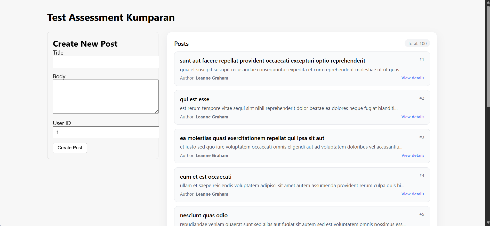

# Small App Test Assessment

##  Project Description
- Paginated list of posts
- Post detail view (title, body, author info, comments)
- Create Post form using GraphQL mutation
- Basic UI/UX with clean component structure

## Tech Stack
- **React (Create React App) + TypeScript**
- **Apollo Client** (`@apollo/client`)
- **GraphQLZero API** — https://graphqlzero.almansi.me/api
- **CSS** (plain CSS)

## Setup & Run Instructions

### 1. Clone the repository
```bash
git clone https://github.com/xxxZino/TEST-ASSESSMENT.git
cd <TEST-ASSESSMENT>
```

### 2. Install dependencies
```bash
npm install
```

### 3. Run development server
```bash
npm start
```
Runs at  http://localhost:3000

## Screenshots

